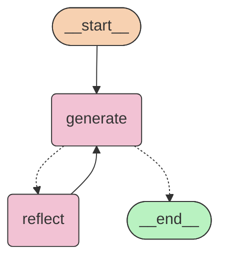

## Reflection Agents for Twitter Generation post.

a reflection agen is an AI system designed to act as an autonomous evaluator and editor its own output(retrieval/answers), employing a "Think-> Do -> Evaluate -> Improve" cycle rather than a single-pass "generate and forget" approach.

# Dependencies:

```bash
    poetry init # isntall env and python with dependencies managed.
    poetry add loaddot langchain-core langgraph black sort
```

# Running

```bash
    poetry run python main.py
```

## Diagrama StateGraph


